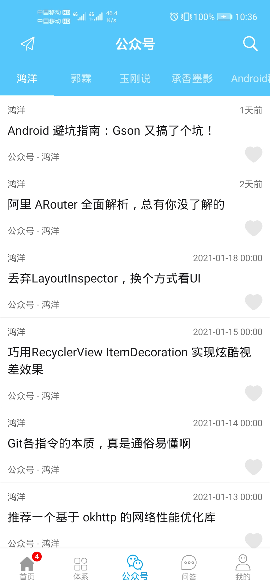
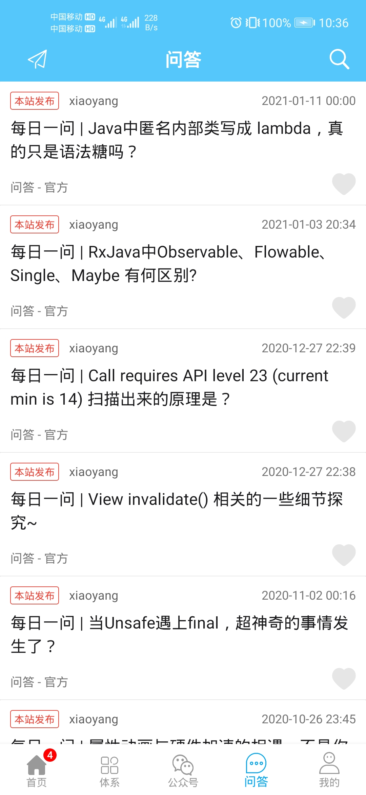
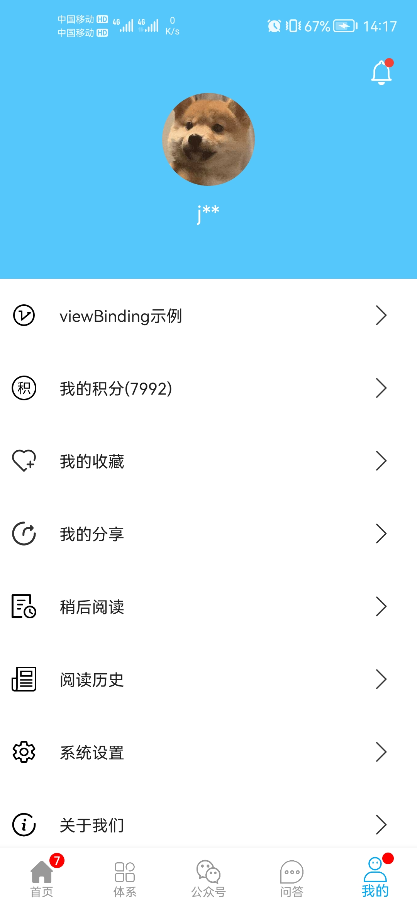
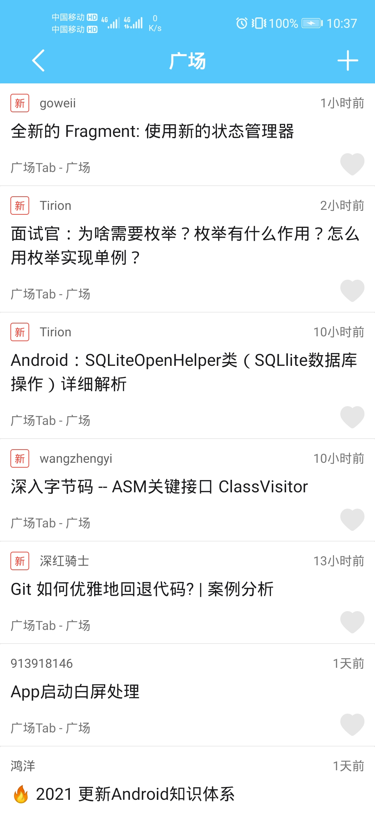
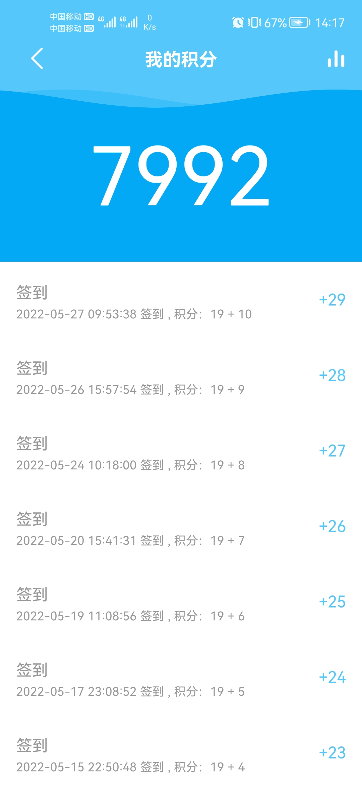
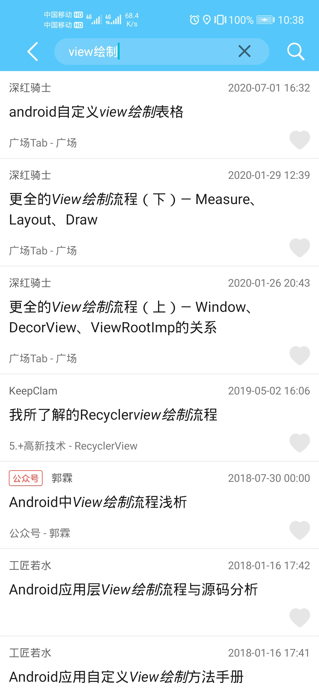

# Kotlin 版 WanAndroid 客户端

**开源不易，如果喜欢的话希望给个 `Star` 或 `Fork` ^_^ ，谢谢~~**

## 前言
工作上一直都是以H5混合开发为主，`Android`原生代码很少用到。前段时间复习了下`kotlin`，顺便学习了下`JetPack`全家桶，就写了个项目熟悉下。希望能对想了解JetPack和kotlin的小伙伴有一点帮助!

## 简介
[MvvM](https://github.com/jzh1996/mvvm) 采用 `Kotlin` 语言编写，结合 `MVVM` + `协程` + `Retrofit` + `Glide` + `JetPack`部分功能 等架构设计的项目，项目代码结构清晰，如有任何疑问和建议请提 [Issues](https://github.com/jzh1996/mvvm/issues) 或联系 qq： **1510931535** ，项目会持续迭代维护。

## 项目截图(需要翻墙才能看到)

|  |  |  |  |
| --- | --- | --- | --- |
|  |  |  |  |

## 下载体验

- 点击 [下载](https://github.com/jzh1996/mvvm/blob/main/app-demo.apk)

## 主要功能

- 登录注册功能；
- 分为首页，体系，公众号，问答，我的，广场六个模块；
- 支持搜索功能；
- 支持收藏，取消收藏功能；
- 支持分享，删除分享功能；
- 我的积分、积分排行榜功能；
- 我的页面支持更换头像，更换背景功能；
- 支持底部导航角标展示功能；

## 后续更新计划

- 新增搜索热词，搜索历史展示；
- 新增TODO模块；
- 新增消息模块；
- 新增阅读历史功能
- 新增系统设置模块，支持取消置顶文章展示，清除缓存，列表动画等功能；
- 支持使用手机浏览器打开文章功能；

## 说明
**项目中的 API 均来自于 [www.wanandroid.com](http://www.wanandroid.com/) 网站，纯属学习交流使用，不得用于商业用途。**

